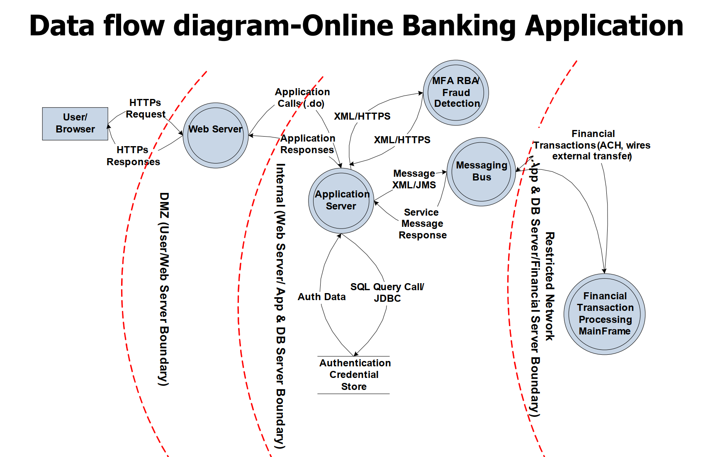
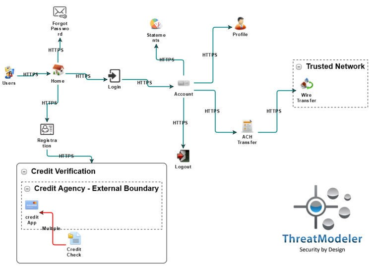

# ATT&CK威胁建模

## 理论依据

[ATTACK-Tools](https://github.com/nshalabi/ATTACK-Tools)

[ATTCK-PenTester-Book](https://github.com/Dm2333/)

[ATTCK中文网](https://huntingday.github.io/)

[ATTCK官网](https://attack.mitre.org/)

## 建模工具

了解威胁建模框架、方法和工具可以帮你更好地识别、量化和排序面临的威胁。

威胁建模是一个结构化的过程，IT专业人员可以通过该过程识别潜在的安全威胁和漏洞，量化每个威胁的严重性，并确定技术的优先级以缓解攻击并保护IT资产。

这个宽泛的定义听起来可能像是网络安全专业人员的职位描述，但是威胁模型的重要之处在于它是系统的和结构化的。威胁建模人员将执行一系列具体步骤，以全

面了解他们试图保护的IT环境，识别漏洞和潜在攻击者。

总的来说，威胁建模在某种程度上仍然是科学和艺术的综合体，并没有单一的威胁建模过程规范。威胁建模的实践借鉴了各种早期的安全实践，最著名的是1990

年代开发的“ 攻击树 ” 的概念。1999年，Microsoft员工Loren Kohnfelder和Praerit Garg在公司内部分发了一份名为“ 我们产品的威胁 ” 的文件¹，该文件被许多人

认为是威胁建模的第一个明确描述。

Kohnfelder和Garg将他们的建议称为“ STRIDE框架”，我们将在本文后面详细讨论它的细节。如今我们已经拥有各种各样的威胁建模框架和方法，这些模型侧重点

不同，其中一些模型针对特定安全技术领域，例如，应用程序安全。在本文中，我们将帮助您了解所有这些方法的共同点，以及哪种特定的技术可能适合您。

## 威胁建模流程和步骤

每种的威胁建模方法都包含一系列步骤，我们将在本文后面的部分中讨论每个步骤的细微差别。首先，我们将看一下所有这些方法共有的基本逻辑流程。对威胁建

模过程最简洁明了的概述之一来自软件工程师Goran Aviani，他指出威胁模型的目的是回答四个问题：

1. 我们面对的是什么？
2. 可能会有哪些问题（威胁）？
3. 我们该怎么做？
4. 我们做得好吗？

反过来，威胁建模过程应包括四个主要步骤，每个步骤都会为这些问题之一提供答案。

1. 分解应用程序或基础架构
2. 确定威胁
3. 确定对策和缓解措施
4. 排序威胁

为了准确了解这些步骤中的每个步骤，我们需要讨论构成威胁建模基础的特定技术。

## 威胁建模技术

上面列出的步骤中，最陌生的术语可能是**分解（Decompose）**。分解应用程序或基础架构意味着什么？软件工程师Andrea Della Corte认为，广义上讲，分解

应用程序包括“了解应用程序及其与外部实体的交互方式。这涉及创建用例，以了解应用程序的使用方式，确定入口点以查看潜在的攻击者可以在哪里与应用程序

进行交互，确定资产（即攻击者可能会感兴趣的项目/区域），并标识表示应用程序将授予外部实体的访问权限的信任级别。” （他在这里专门谈论应用程序安全

性，但是显然，从广义上讲，这也适用于对基础结构的看法。）

分解应用程序的一种技术是构建**数据流程图**。这是1970年代开发的一种方法，以可视方式展示数据如何在应用程序或系统中移动，以及各个组件在何处更改或

存储数据。其中**信任边界**是在2000年代初期添加进来的概念，特指数据流中的卡点，在该点上需要对数据进行验证，然后数据才能被接收该数据的实体使用。信

任边界是用数据流程图进行威胁建模的关键。

### 在线银行应用的数据流程图示例

下图是在线银行应用程序的数据流程图；虚线表示信任边界，数据可能会在信任边界被更改，因此需要采取安全措施。

网上银行应用程序的数据流程图（作者为Wei Zhang和Marco Morana，以OWASP许可分发）

更深入的数据流程图威胁建模方法可以参考微软的这个文档²。

由于数据流程图是由系统工程师而不是安全专家开发的，因此它们包含了许多威胁建模不需要的开销。数据流程图的一种替代方法是过程流程图_。_两者在总体概念

上相似，但后者更加精简，并且侧重于用户和执行代码在系统中的移动方式，更紧密地反映了攻击者的思维方式（例如下图）。

绘制攻击树也是一种威胁建模技术，当您确定要对应用程序或基础结构潜在威胁的阶段时，它就变得非常重要。攻击树由90年代后期的信息安全传奇人物布鲁斯·

施耐尔（Bruce Schneier）开创。它们由代表不同事件的一系列父节点和子节点组成，子节点是必须满足的条件才能使父节点为真。根节点（图中的最高父节点）

是攻击的总体目标。借助攻击树，威胁建模者可以看到必须组合哪些情况才能使威胁成功。下图显示了一个简单的银行应用攻击树，说明了病毒可能成功感染文件

的不同方式。

下图是Hackinthebox从攻击者的角度构建的攻击树示例，可以帮助您了解自己所面临的威胁。

确定对策和对威胁进行排序的技术因框架或方法不同而相差较大，详细介绍如下：

## 威胁建模框架和方法

威胁建模的各种结构化方法通常称为_框架_或_方法论_（本文中这两个术语基本上可以互换使用）。目前的威胁建模框架和方法有很多，我们挑几个最流行的介绍如下：

### 7种顶级威胁建模方法

1. STRIDE
2. DREAD
3. PASTA
4. VAST
5. Trike
6. OCTAVE
7. NIST

### **STRIDE威胁建模**

如上所述，STRIDE是威胁建模的祖父，最早于90年代末在Microsoft开发。STRIDE代表六种威胁，每种都对CIA三要素构成威胁，具体如下：

* **欺骗**或冒充他人或计算机，影响真实性
* **篡改**数据，这会**破坏**完整性
* **抵赖**，或无法将执行的操作关联到操作者，这违反了不可抵赖性
* **信息泄露**，违反机密性
* **拒绝服务**，这违反了可用性
* **特权提升**，违反授权

### **DREAD威胁建模**

DREAD被认为是STRIDE模型的一个附加组件，该模型使建模人员可以在确定威胁后对其进行排名。对于每个潜在威胁，DREAD代表六个问题：

* **潜在损害**：如果利用漏洞，造成的损害有多大？
* **重现性**：重现攻击有多容易？
* **可利用性**：发动攻击有多容易？
* **受影响的用户**：大概影响了多少用户？
* **可发现性**：查找漏洞有多容易？

这些问题中的每一个都得到1-3分的评分。

### **PASTA威胁建模**

PASTA代表攻击模拟和威胁分析过程，它是一个七步骤过程，致力于使技术安全要求与业务目标保持一致。每个步骤都非常复杂，由几个子步骤组成，但是总体顺

序如下：

1. 定义目标
2. 定义技术范围
3. 应用程序分解
4. 威胁分析
5. 漏洞和弱点分析
6. 攻击建模
7. 风险与影响分析

### **VAST威胁建模**

VAST代表可视化，敏捷威胁建模。该模型是 ThreatModeler（自动威胁建模平台）的基础，该平台可以区分应用程序和运营威胁模型。VAST专为集成到围绕

devops构建的工作流中而设计。

### **Trike威胁建模**

Trike是用于威胁建模和风险评估的框架的开源工具，它基于防御的角度，而不是试图模仿攻击者的思维过程。使用Trike，您可以为要防御的系统建模，并通过

CRUD的角度评估每个组件，也就是说，谁可以创建，读取，更新或删除该实体。通过遍历数据流程图来识别威胁，每种威胁仅分为两类：拒绝服务或特权提升。

### **OCTAVE威胁建模**

OCTAVE代表“运营关键威胁，资产和脆弱性评估”，是卡耐基梅隆大学开发的一种威胁建模方法，其重点是组织风险而不是技术风险。它包括三个阶段：

1. 建立基于资产的威胁配置文件
2. 识别基础架构漏洞
3. 制定安全策略和计划

### **NIST威胁建模**

美国国家标准技术研究院拥有自己的以数据为中心的威胁建模方法，该方法包括四个步骤：

1. 系统和数据识别和表征
2. 识别并选择要包含在模型中的攻击媒介
3. 表征缓解攻击媒介的安全控件
4. 分析威胁模型

该NIST草案还包括一个方法的具体应用实例。如果您正在寻找**威胁建模示例**，那么这是一个很棒的文档，可以阅读该文档以了解流程如何工作。

## 威胁建模最佳实践

无论选择哪种框架，都应遵循一些实践方法。但最重要的（通常也是很难做到的）是将威胁建模作为系统开发过程中的优先事项。如果能在项目开发伊始就做到这

一点，以后可以省去很多麻烦，因为安全性可以被深深“植入”到应用程序或系统中。

另一个最佳实践是不要将应用程序和系统彼此隔离。Michael Santarcangelo写道： “如果各种威胁模型以相同的方式相互连接，并且应用程序和组件作为IT系统的

一部分进行交互，那么结果将是一个全面的攻击面，CISO可以使用该攻击面来理解整个企业的整体威胁组合。”

我们还敦促您避免常见的威胁建模错误。简而言之：不要过于关注头条新闻上的威胁；不要忘记，您的用户可能是所有人中最大的无意威胁。并且不要忘记，威胁

模型应该是“活着”的文档，并且需要不断更新。

## 威胁建模工具

需要指出的是，上面列出的两种方法（VAST和Trike）实际上是围绕特定的软件工具构建的。还有一些支持其他方法的工具，例如，Microsoft提供了免费的威胁建

模工具，而OWASP Foundation也推出了自己的桌面和web版本的威胁建模工具——Threat Dragon³。

实际上，这里描述的许多方法都是概念性的，并未与任何软件联系在一起。攻击树或数据流程图可以用笔和纸绘制。正如Luca Bongiorni的演讲所解释的那样，用

于威胁建模的一些最受欢迎的工具是Microsoft Visio和Excel。开始为基础架构进行威胁建模的门槛很低，但回报却很高。

## 参考资料：

### **【1】最早的威胁建模论文：**

[https://www.microsoft.com/security/blog/2009/08/27/the-threats-to-our-products/](https://www.microsoft.com/security/blog/2009/08/27/the-threats-to-our-products/)

### **【2】Uncover Security Design Flaws Using The STRIDE Approach：**

[https://docs.microsoft.com/en-us/archive/msdn-magazine/2006/november/uncover-security-design-flaws-using-the-stride-approach](https://docs.microsoft.com/en-us/archive/msdn-magazine/2006/november/uncover-security-design-flaws-using-the-stride-approach)

### **【3】OWASP威胁建模工具：**

Threat Dragon：[https://owasp.org/www-project-threat-dragon/](https://owasp.org/www-project-threat-dragon/)

